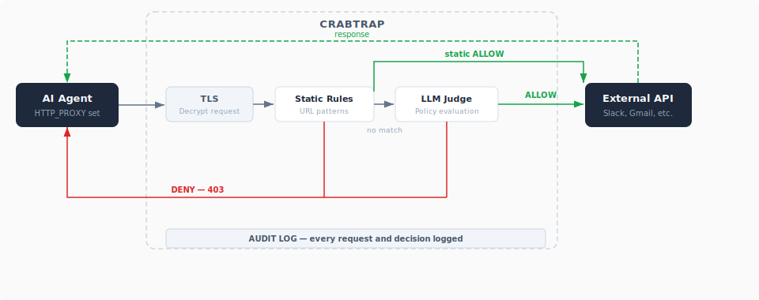

# CrabTrap

<p align="center">
  
</p>

An HTTP/HTTPS proxy that sits between AI agents and external APIs, evaluating every outbound request against security policies before it reaches the internet.

If you run AI agents that call external services — Slack, Gmail, GitHub, or anything else — CrabTrap gives you guardrails. It intercepts every outbound HTTP/HTTPS request, checks it against deterministic rules and an LLM-based policy judge, and either forwards it or blocks it with a reason. Every request and decision is logged to PostgreSQL for a complete audit trail.

<p align="center">
  
</p>

## Quickstart

CrabTrap runs as a Docker container alongside PostgreSQL. See [QUICKSTART.md](QUICKSTART.md) for the full walkthrough — the short version:

```bash
docker compose up -d                                                    # start CrabTrap + Postgres
docker compose cp crabtrap:/app/certs/ca.crt ./ca.crt                   # copy the generated CA cert
# create test-admin admin user and store their web_token in a variable
admin_token=$(docker compose exec -it crabtrap ./gateway create-admin-user test-admin \
    | tail -n1 | cut -d" " -f2)
token=$(curl -X POST http://localhost:8081/admin/users \
    -H "Content-Type: application/json" \
    -H "Authorization: Bearer ${admin_token}" \
    -d '{"id": "alice@example.com", "is_admin": false}' \
    | jq -r '.channels[] | select(.channel_type == "gateway_auth") | .gateway_auth_token')
# test with
curl -x http://${token}:@localhost:8080 \
    --cacert ca.crt https://httpbin.org/get
```

The proxy listens on `localhost:8080`, the admin UI is at `localhost:8081` and you can login to it with the $admin_token.


## How It Works

1. **Agent connects** — set `HTTP_PROXY` and `HTTPS_PROXY` to point at CrabTrap
2. **TLS termination** — CrabTrap generates a per-host certificate from a custom CA and decrypts the request
3. **Static rules** — the request is matched against URL pattern rules (prefix, exact, or glob). If a rule matches, the decision is immediate — no LLM call. Deny rules always take priority over allow.
4. **LLM judge** — if no static rule matches, the request is evaluated by an LLM against the agent's natural-language security policy. Allowed requests are forwarded; denied requests get a 403 with the reason.
5. **Audit logged** — every request, decision, and response is recorded in PostgreSQL

## Features

### Security

- **HTTPS interception** — transparent MITM proxy with custom TLS server certificate generation
- **SSRF protection** — blocks requests to private networks (RFC 1918, loopback, link-local, Carrier-Grade NAT, IPv6 ULA/NAT64/6to4) with DNS-rebinding prevention
- **Prompt injection defense** — request payloads are JSON-encoded and policy content is JSON-escaped before being sent to the LLM judge
- **Per-IP rate limiting** — token bucket rate limiter (default 50 req/s, burst 100)

### Policy Evaluation

- **Two-tier evaluation** — deterministic static rules are checked first; the LLM judge is only invoked if no rule matches
- **Static rules** — prefix, exact, and glob URL pattern matching with optional HTTP method filters
- **Per-agent LLM policies** — natural-language security policies evaluated via LLM
- **Circuit breaker** — trips after 5 consecutive LLM failures, reopens after 10s cooldown
- **Configurable fallback** — deny (default) or passthrough when the LLM judge is unavailable

### Operations

- **Policy builder** — an agentic loop that analyzes observed traffic and drafts security policies automatically
- **Eval system** — replay historical audit log entries against a policy to measure accuracy
- **Web UI** — audit trail viewer, policy editor, eval results, and agent management

## What CrabTrap Does NOT Do

- **Not a WAF or inbound firewall** — CrabTrap is a forward proxy (outbound-only) for agent-originated traffic. It does not inspect inbound requests to your services.
- **Does not redact sensitive data** — the proxy sees all request content in cleartext, including headers like Authorization and Cookie. This is by design; the trust boundary is the proxy itself.
- **Does not provide human-in-the-loop approval** — there is no approval queue, no Slack prompts, and no escalation path. Decisions are made automatically by static rules and the LLM judge.
- **Does not filter API responses** — only outbound requests are evaluated. Responses from upstream APIs are streamed back to the agent unexamined.
- **Does not inspect WebSocket frames** — only the WebSocket upgrade request is evaluated. Once upgraded, frames pass through uninspected.

## Configuration

| Section | Key Settings |
|---|---|
| `proxy` | Port (default 8080), timeouts, rate limits, SSRF CIDR allowlist |
| `tls` | CA cert/key paths, certificate cache size (default 10,000) |
| `approval` | Mode: `llm` or `passthrough`, timeout (default 30s) |
| `llm_judge` | Provider, model IDs, fallback mode (`deny`/`passthrough`), circuit breaker |
| `database` | PostgreSQL connection URL (supports `${DATABASE_URL}` expansion) |
| `audit` | Output destination: `stderr` (default), `stdout`, or a file path |
| `log_level` | `debug`, `info` (default), `warn`, `error` |

See [`config/gateway.yaml.example`](config/gateway.yaml.example) for the full reference with inline comments.

## Project Structure

```
crabtrap/
├── cmd/gateway/          # Entry point, admin API wiring, web UI serving
├── internal/
│   ├── proxy/            # MITM proxy, TLS cert generation, SSRF protection, rate limiting
│   ├── approval/         # Static rules engine + approval orchestration
│   ├── judge/            # LLM judge prompt construction + response parsing
│   ├── llm/              # LLM adapters, circuit breaker, concurrency control
│   ├── builder/          # Policy agent (agentic loop with tools)
│   ├── eval/             # Eval system (replay audit entries against policies)
│   ├── admin/            # Admin API routes, auth, user/audit stores
│   ├── llmpolicy/        # Policy storage and versioning
│   ├── audit/            # Structured JSON logging + event dispatch
│   ├── config/           # YAML config loading, validation, defaults
│   ├── db/               # PostgreSQL connection pool + migrations
│   └── notifications/    # SSE channel + event dispatcher
├── pkg/types/            # Shared types (StaticRule, LLMPolicy, AuditEntry, etc.)
├── web/src/              # React + TypeScript admin UI (Vite)
├── config/               # YAML configuration files
├── certs/                # Generated TLS certificates (not committed)
└── scripts/              # Certificate generation, database migrations
```

## Development

```bash
make test          # lint (go vet + staticcheck) then tests with -race
make fmt           # format Go code
make lint          # go vet + staticcheck
make build         # production binary with embedded web UI
make build-web     # rebuild web UI only
```

See [CONTRIBUTING.md](CONTRIBUTING.md) for the full development workflow, PR guidelines, and coding conventions.

## Releases

Releases are automated with [GoReleaser](https://goreleaser.com/) via GitHub Actions. Tag a commit on `main` and push:

```bash
git tag v1.2.3
git push origin v1.2.3
```

This builds cross-platform binaries (linux/darwin, amd64/arm64), creates a GitHub Release with a changelog, and pushes multi-arch Docker images to `quay.io/brexhq/crabtrap`.

See [CONTRIBUTING.md](CONTRIBUTING.md#releasing-with-goreleaser) for release notes and commit message conventions.

## License

This project is licensed under the [MIT License](LICENSE).

## Contributing

We welcome contributions! Please read [CONTRIBUTING.md](CONTRIBUTING.md) for guidelines on getting started, running tests, and submitting pull requests.

## More

- Troubleshooting: [TROUBLESHOOTING.md](TROUBLESHOOTING.md)
- Architecture: [DESIGN.md](DESIGN.md)
- Issues: https://github.com/brexhq/CrabTrap/issues
